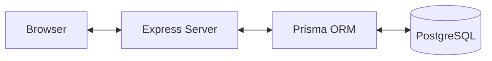

# Full-Stack Migration Plan — NO DUE Academic Portal

Migrating the current React SPA from `localStorage` to a centralized PostgreSQL database with a Node.js backend to enable multi-user access and persistent data.

## Architecture

## Proposed Changes

### 1. Database Schema (PostgreSQL via Prisma)

#### [NEW] [schema.prisma](file:///c:/Users/sricb/OneDrive/Desktop/New%20folder%20(2)/NO%20DUE/server/prisma/schema.prisma)
- **User**: `id`, `username`, `password` (hashed), `role` (ADMIN, FACULTY, STUDENT)
- **Department**: `id`, `name`
- **Subject**: `id`, `name`, `facultyId`, `sectionId`
- **Student**: `userId`, `studentId`, `dept`, `year`, `section`
- **Faculty**: `userId`, `facultyId`, `name`
- **NoDueRecord**: `id`, `studentId`, `subjectId`, `status`, `message`

### 2. Backend (Node.js/Express)

#### [NEW] [server/index.js](file:///c:/Users/sricb/OneDrive/Desktop/New%20folder%20(2)/NO%20DUE/server/index.js)
- Express server setup with CORS and JSON body-parser.

#### [NEW] [server/routes/](file:///c:/Users/sricb/OneDrive/Desktop/New%20folder%20(2)/NO%20DUE/server/routes/)
- **auth.js**: Secure login with JWT.
- **academic.js**: Endpoints for managing departments, years, sections, and subjects.
- **nodue.js**: Endpoints for faculty to update status and students to view it.

### 3. Frontend Refactor

#### [MODIFY] [DataContext.tsx](file:///c:/Users/sricb/OneDrive/Desktop/New%20folder%20(2)/NO%20DUE/src/context/DataContext.tsx)
- Replace all `localStorage` logic with `fetch` calls to the new backend.
- Maintain a central cache of the academic structure in memory.

#### [MODIFY] [AdminDashboard.tsx](file:///c:/Users/sricb/OneDrive/Desktop/New%20folder%20(2)/NO%20DUE/src/pages/AdminDashboard.tsx)
- Modify file upload logic to send files to the backend for parsing, or parse on frontend and send JSON to DB.

---

## Verification Plan

### Automated Tests
- Postman/Insomnia collection for testing API endpoints.
- Prisma studio for database verification.

### Manual Verification
- Deploy local PostgreSQL via Docker.
- Verify Admin upload affects data seen by Faculty on a different browser window.
- Verify Student sees status changes made by Faculty in real-time (after refresh).
