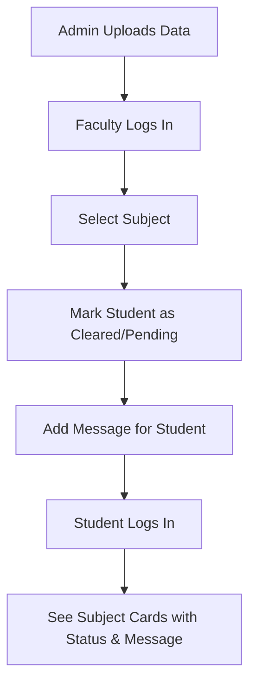

# NO DUE Academic Portal — Implementation Walkthrough

I have successfully implemented the missing core features for the Academic Portal. The app now supports full "No Due" lifecycle management across Admin, Faculty, and Student roles.

## Key Accomplishments

### 1. Data Layer & Type Safety
- **State Management**: Added `noDueRecords` to `DataContext.tsx`, persisted to `localStorage`.
- **New Actions**: Implemented `setNoDueStatus`, `updateNoDueMessage`, and `getNoDueRecord` helpers.
- **Typed Records**: Defined `NoDueRecord` interface in `academic.ts`.

### 2. Admin: Subject Management
- **Add Subject**: Admin can now add new subjects to any department/year/section via an inline form.
- **Improved UX**: Sub-component `AddSubjectForm` provides a clean interface for entering subject name and selecting faculty.

### 3. Faculty: No-Due & Messaging
- **Status Marking**: Faculty see a student list with toggle buttons to mark status as `🟢 Cleared` or `🔴 Pending`.
- **Communication**: Added a messaging system where faculty can leave specific feedback (e.g., "Submit lab record") per student-subject.
- **Real-time Updates**: Changes save instantly to `localStorage` and reflect on student dashboards.

### 4. Student: Enhanced Visibility
- **Status Badges**: Students now see clear green/red status indicators on their subject cards.
- **Faculty Messages**: Messages from faculty are prominently displayed with a dedicated icon and styling.
- **Visual Feedback**: Subject cards feature status-colored top borders for immediate awareness.

## System Logic Flow

## Changes Summary

- [DataContext.tsx](file:///c:/Users/sricb/OneDrive/Desktop/New%20folder%20(2)/NO%20DUE/src/context/DataContext.tsx) — Added persistence and logic for No-Due records.
- [AdminDashboard.tsx](file:///c:/Users/sricb/OneDrive/Desktop/New%20folder%20(2)/NO%20DUE/src/pages/AdminDashboard.tsx) — Added "Add Subject" feature.
- [FacultyDashboard.tsx](file:///c:/Users/sricb/OneDrive/Desktop/New%20folder%20(2)/NO%20DUE/src/pages/FacultyDashboard.tsx) — Added marking tools and messaging.
- [StudentDashboard.tsx](file:///c:/Users/sricb/OneDrive/Desktop/New%20folder%20(2)/NO%20DUE/src/pages/StudentDashboard.tsx) — Added status and message display.

---

> [!NOTE]
> All data is stored locally in your browser's `localStorage`. No database setup is required.
